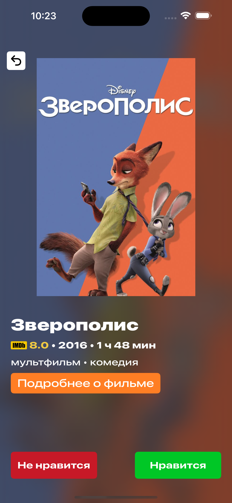

# MovieMate: Watch Together

## Описание

**MovieMate: Watch Together** — приложение позволяющее легко и удобно выбрать кино для совместного досуга.

Иногда нет ничего лучше, чем посмотреть хороший фильм в конце дня. 
В один клик доступен бесконечный каталог фильмов, но... 
Вы когда-нибудь тратили слишком много времени на обсуждение того, что смотреть с вашим партнером? 
Если ваш ответ "да", это приложение идеально для вас.

### Ключевые особенности:
- Подборки фильмов по жанрам для двух (и более) человек
- Алгоритм поиска обоюдно понравившихся фильмов
- Удобный интерфейс для выбора кино

## Скриншоты

### Главный экран

### Выбор жанра

### Выбор фильма

### Итоговый результат

## Технологии и инструменты

### Требования
- Устройство под управлением iOS 15.0 или выше.

### Стек технологий
- Swift
- UIKit
- Combine
- Swift Concurrency
- Alamofire
- Cocoapods

### Структура проекта

- `MovieMate/` - исходные файлы приложения
- `MovieMateTests/` - модульные тесты

**MovieMate: Watch Together** - ваш надежный спутник для выбора фильма на вечер. Наслаждайтесь просмотром вместе!
